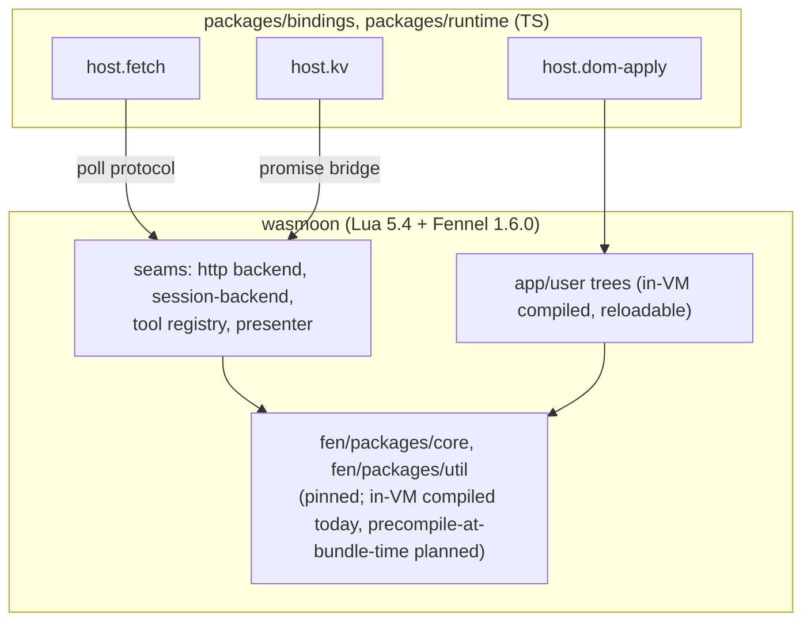

# fen-web docs

Browser-resident fen: a Fennel→Lua agent running in-page via wasmoon. Tracks
[fen#99](https://github.com/acmiyaguchi/fen/issues/99); repo-local issue
numbers below refer to `acmiyaguchi/fen-web`.

## How the pieces fit

TypeScript supplies a small set of host primitives (`host.fetch`, `host.kv`,
`host.dom-apply`, `host.msg`, `host.ext`); everything else — policy, tools,
rendering — is Fennel running inside the VM. See
[architecture/fennel-first.md](architecture/fennel-first.md) for the rule and
[architecture/seams.md](architecture/seams.md) for how fen's existing
extension points get filled without touching `fen/`.

## Map

- **architecture/** — the Fennel-first rule and the seams fen exposes.
  - [fennel-first.md](architecture/fennel-first.md)
  - [seams.md](architecture/seams.md)
- **runtime/** — booting and reloading the VM (packages/runtime).
  - [module-loading.md](runtime/module-loading.md) — issue #16 decision
  - [reload.md](runtime/reload.md) — `/reload` scope and mechanics
  - [boot.md](runtime/boot.md) — `createFenRuntime`, coroutine pump, issue #1
- **bindings/** — TS host primitives (packages/bindings).
  - [host-protocol.md](bindings/host-protocol.md) — `__fen_host`, poll pattern
  - [fetch.md](bindings/fetch.md) — `host.fetch` + fetch backend
  - [kv.md](bindings/kv.md) — `host.kv`
  - [dom.md](bindings/dom.md) — `host.dom-apply` (issue #6)
- **platform/** — Fennel-side shims and registrations over the host primitives.
  - [shims.md](platform/shims.md) — issue #15, host IO profiles (#22)
  - [tools.md](platform/tools.md) — issue #4
  - [sessions.md](platform/sessions.md) — issue #14
- **apps/** — the two delivery shapes.
  - [demo.md](apps/web.md) — issues #6-#9
  - [extension.md](apps/extension.md) — deferred, fen#100 / issue #11
- **[integration.md](integration.md)** — the #5 milestone test and the
  opt-in live Codex e2e harness (`packages/integration`).

## Status at a glance

**Phase 1 (bootstrap) milestone is CLOSED** — all 9 phase-1 issues
(#1-#5, #12-#15) are closed. `packages/bindings` (host.fetch/host.kv),
`packages/runtime` (wasmoon boot), `packages/platform` (shims, browser
file tools, kv session backend), and `packages/integration` (the #5
headless-turn milestone test) are all implemented and on `main`. CI is
green (build + Fennel/Busted tests through the Nix flake, #12), and live
provider validation against real OpenAI Codex has been run via the opt-in
`e2e:codex` harness (never in CI) — see [integration.md](integration.md).

Open follow-ups from phase-1 review, not blocking: cjson-null truthiness
in the OpenAI adapter's stream loop (#17, upstream fen#482), first-class
wasmoon file mounts for Node hosts (#18), a persisted chunk cache for
page-load compile cost (#19), cooperative-retry busy-spin backpressure
(#20), `require`/pump reentrancy (#21), and formalizing the two host IO
profiles (#22, see [platform/shims.md](platform/shims.md)).

`apps/web`'s DOM presenter (#6) has landed: the `host.dom-apply` primitive
(`packages/bindings/src/dom`, see [bindings/dom.md](bindings/dom.md)) plus a
Fennel DOM presenter (`apps/web/fnl/fen_web/web`, see
[apps/web.md](apps/web.md)) that reuses fen's compositional panel/fragment
model and diffs one batched mutation list per frame. The BYO-key single-page
shell (#7) has landed on top: `apps/web` is now a Vite-bundled working
page that boots the runtime + bindings + presenter and runs an Anthropic
turn end to end, with API keys stored browser-locally in IndexedDB. The
rest of `apps/web` (#8-#9, iframe preview, starter project) and
`apps/extension` (#11, deferred, trails the demo) remain design-only. See
the top-level [README.md](../README.md) for the architecture summary and
layout.
