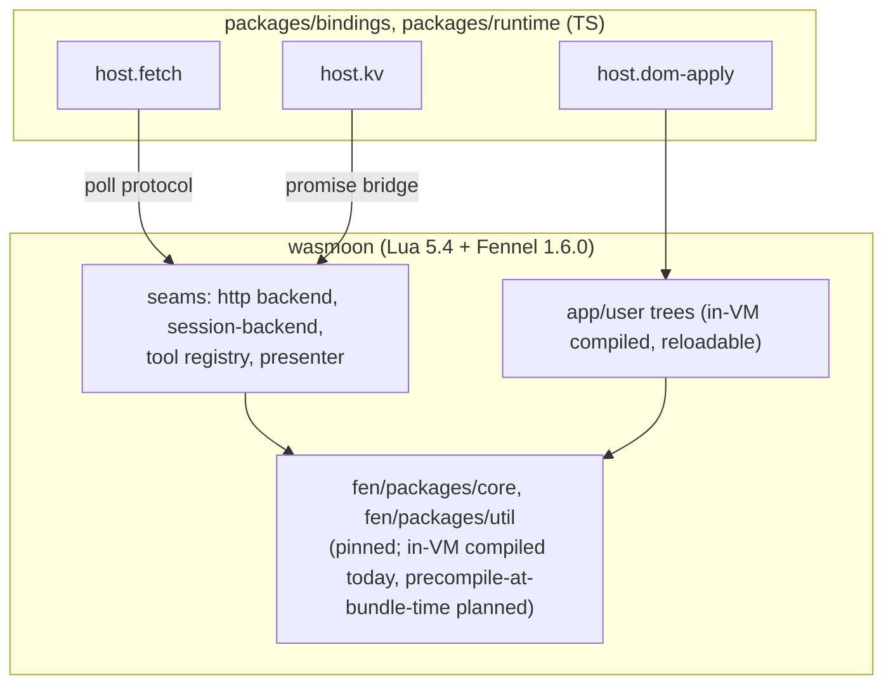

# fen-web docs

Browser-resident fen: a Fennel→Lua agent running in-page via wasmoon. Tracks
[fen#99](https://github.com/acmiyaguchi/fen/issues/99); repo-local issue
numbers below refer to `acmiyaguchi/fen-web`.

## How the pieces fit

TypeScript supplies a small set of host primitives (`host.fetch`, `host.kv`,
`host.dom-apply`, `host.msg`, `host.ext`); everything else — policy, tools,
rendering — is Fennel running inside the VM. See
[architecture/fennel-first.md](architecture/fennel-first.md) for the rule and
[architecture/seams.md](architecture/seams.md) for how fen's existing
extension points get filled without touching `fen/`.

## Map

- **architecture/** — the Fennel-first rule and the seams fen exposes.
  - [fennel-first.md](architecture/fennel-first.md)
  - [seams.md](architecture/seams.md)
- **runtime/** — booting and reloading the VM (packages/runtime).
  - [module-loading.md](runtime/module-loading.md) — issue #16 decision
  - [reload.md](runtime/reload.md) — `/reload` scope and mechanics
  - [boot.md](runtime/boot.md) — `createFenRuntime`, coroutine pump, issue #1
- **bindings/** — TS host primitives (packages/bindings).
  - [host-protocol.md](bindings/host-protocol.md) — `__fen_host`, poll pattern
  - [fetch.md](bindings/fetch.md) — `host.fetch` + fetch backend
  - [kv.md](bindings/kv.md) — `host.kv`
- **platform/** — Fennel-side shims and registrations over the host primitives.
  - [shims.md](platform/shims.md) — issue #15
  - [tools.md](platform/tools.md) — issue #4
  - [sessions.md](platform/sessions.md) — issue #14
- **apps/** — the two delivery shapes.
  - [demo.md](apps/demo.md) — issues #6-#9
  - [extension.md](apps/extension.md) — deferred, fen#100 / issue #11

## Status at a glance

Phase 1 (bootstrap) is in progress. `packages/bindings` (fetch + kv
primitives, issues #2/#3) and `packages/runtime` (wasmoon boot, issue #1)
are implemented and landed on `main` at commit `02f4b1a`. Currently being
implemented: the platform layer over those primitives — shims (#15),
virtual-FS tools (#4), session backend (#14) — and CI (#12). Next up:
issue #5, one headless agent turn against a stub provider, which is the
phase-1 milestone these all feed. `apps/demo` (#6-#9) and `apps/extension`
(#11) remain design-only. See the top-level [README.md](../README.md) for
the architecture summary and layout.
